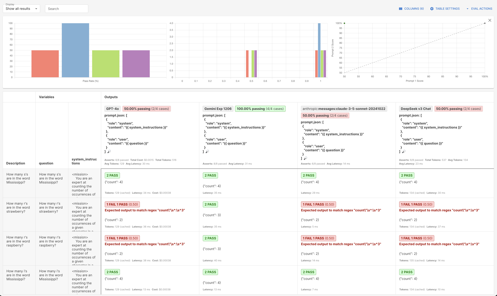

# promptfoo-evals-starter
A simple repo that helps you get started with AI evals using [promptfoo](https://promptfoo.dev/).

Every wondered how to run evals on your own prompts? Then this repo gets you from 0 to hero in no time.



If you find this repo useful, please give it a star and follow me on X ([@s_streichsbier](https://x.com/s_streichsbier)) for more content like this.

## Getting started

### Install promptfoo
```
npm install -g promptfoo@latest
```

### Set up your API keys

> Note: You can remove providers you don't care about in the `promptfooconfig.yaml` file.

- [OpenAI](https://platform.openai.com/settings/organization/api-keys): `export OPENAI_API_KEY=<your-key>`
- [Anthropic](https://console.anthropic.com/settings/keys): `export ANTHROPIC_API_KEY=<your-key>`
- [Google](https://aistudio.google.com/app/apikey): `export GOOGLE_API_KEY=<your-key>`
- [DeepSeek](https://platform.deepseek.com/api_keys): `export DEEPSEEK_API_KEY=<your-key>`
- [Groq](https://console.groq.com/keys): `export GROQ_API_KEY=<your-key>`
- [xai](https://console.x.ai/): `export XAI_API_KEY=<your-key>`
- [OpenRouter](https://openrouter.ai/settings/keys): `export OPEN_ROUTER_API_KEY=<your-key>`

## Run the evals
```sh
# Navigate to the directory of the eval you want to run
cd counting_characters_in_words

# Run the eval
promptfoo eval

# Run the eval without cache
promptfoo eval --no-cache
```

## View the results

```sh
# Default port is 15500,
# -y opens the browser automatically
promptfoo view -y 

# Specify a different port
promptfoo view -p 1337 -y
```

## Directory structure

```
.
├── counting_characters_in_words
│   ├── promptfooconfig.yaml
│   ├── system_instructions.md
│   ├── test-r-in-raspberry.yaml
│   └── test-r-in-strawberry.yaml
```

- `counting_characters_in_words`: The directory containing the eval
- `promptfooconfig.yaml`: The configuration file for promptfoo containing the prompts and models to use
- `system_instructions.md`: The system instructions for the eval
- `prompt.json`: contains the prompt format for the eval
- `test-*.yaml`: The test files for the eval

## Best practices

- Use XML for the prompt format, it works best for LLMs. See this video for details [BEST Prompt Format: Markdown, XML, or Raw?](https://www.youtube.com/watch?v=W6Z0U11nnhA) for an example.
- Use JSON responses for the eval, this makes it easier to parse the results and run assertions.
- Add a `defaultTest` section to the `promptfooconfig.yaml` file with the expected JSON schema.

## Models

### OpenAI
- `gpt-3.5-turbo`
- `gpt-4o-mini`
- `gpt-4o`

> the o1 models don't support system messages at the moment.

### Anthropic
- `claude-3-5-haiku-20241022`
- `claude-3-5-sonnet-20241022`

### Google
- `gemini-1.5-flash-002`
- `gemini-1.5-flash-8b`
- `gemini-1.5-pro`
- `gemini-2.0-flash-exp`
- `gemini-2.0-flash-thinking-exp-1219`
- `gemini-exp-1206`

### DeepSeek
- `deepseek-v3`

### Groq
- `llama-3.3-70b-versatile`

### xai
- `grok-2`

### OpenRouter

Also check out [OpenRouter](https://openrouter.ai/settings/keys) for more models.